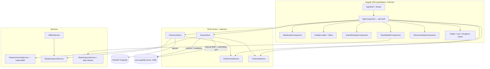

# Pokédex Trainer Dashboard

A single-page **Angular 18** application where a Pokémon trainer can browse Pokémon, build teams, track battles, and manage their trainer profile using GraphQL.

---

## Setup instructions

### Prerequisites

- Node.js 18+
- npm 9+

### Install and run

```bash
# 1. Install dependencies
npm install

# 2. Terminal 1 — local mock GraphQL server (teams, battles, profile, battle logs)
npm run mock:graphql

# 3. Terminal 2 — Angular dev server
npm start
```

Open **http://localhost:4200/**

### Other commands

```bash
npm run build    # production build
npm test         # unit tests (Karma + Jasmine)
```

### GraphQL endpoints

| API | URL | Purpose |
|-----|-----|---------|
| PokéAPI (public) | `https://beta.pokeapi.co/graphql/v1beta` | Pokémon list, detail, types |
| Local mock | `http://localhost:4000` | Trainer, teams, battles, mutations |

Start the mock server with:

```bash
npx json-graphql-server db.js --port 4000
```

(or `npm run mock:graphql`)

> **Note:** `db.js` uses the key `battleLogs` (camelCase), not `battle_log`. The latter breaks `json-graphql-server` on Windows due to a schema resolver mismatch.

---

## Architecture diagram



### Project structure

```
src/app/
├── state/
│   ├── pokemon.store.ts        # BehaviorSubject Pokémon cache
│   ├── trainer.store.ts        # BehaviorSubject trainer / team / battle data
│   ├── pokemon.selectors.ts    # Filtered, sorted, debounced search streams
│   └── trainer.selectors.ts    # Win rate, monthly battle stats
├── core/graphql/
│   ├── pokemon.queries.ts      # PokéAPI queries
│   └── local.queries.ts        # Local mock queries + mutations
├── components/
│   ├── dashboard/              # Hero, KPI cards, charts
│   ├── pokemon-detail/         # Slide-in panel, video, cry audio
│   ├── team-builder/           # Advanced form (FormArray, async validators)
│   ├── virtual-pokedex/          # CDK virtual scroll (Bonus 1)
│   └── charts/                 # Chart.js radar, line, doughnut, bar
├── services/
│   ├── pokemon-cache.service.ts
│   ├── offline.service.ts
│   ├── mutation-queue.service.ts
│   └── stats-analysis.service.ts
├── workers/
│   └── stats-analysis.worker.ts
├── directives/
│   └── type-highlight.directive.ts
└── utils/
    └── validators.ts
```

---

## Screenshots

Place captured UI images under `docs/screenshots/`:

| File | View |
|------|------|
| `dashboard-overview.png` | Dashboard hero + KPI cards + charts |
| `dashboard-details.png` | Recent battles + badges |
| `pokedex.png` | Pokédex table, filters, distribution chart |
| `teams.png` | My Teams cards |
| `battle-log.png` | Battle log form + live feed |
| `profile.png` | Trainer profile |

```md


```

---

## Requirements coverage

| # | Requirement | Status |
|---|-------------|--------|
| **1** | PokéAPI queries (paginated list, detail by ID, types/matchups) | ✅ |
| **1** | Local queries (trainer, teams, battles, battle logs) | ✅ |
| **1** | Local mutations (team CRUD, log battle, update profile) | ✅ |
| **1** | Simulated subscription — `interval(5000)` + `switchMap` poll on battle logs | ✅ |
| **2** | Custom RxJS stores (`BehaviorSubject`) | ✅ |
| **2** | Selectors with `map`, `distinctUntilChanged`, `combineLatest` | ✅ |
| **2** | Optimistic updates + rollback on team mutations | ✅ |
| **2** | Debounced search `debounceTime(300)` + `switchMap` | ✅ |
| **2** | `shareReplay(1)` for type effectiveness | ✅ |
| **2** | `retry(3)` on PokéAPI calls | ✅ |
| **2** | `takeUntilDestroyed` cleanup | ✅ |
| **3** | `signal`, `computed`, `effect`, `toSignal` | ✅ |
| **3** | `input()`, `output()`, `model()` | ✅ |
| **3** | OnPush + standalone + `inject()` | ✅ |
| **4** | Radar chart (Pokémon stats) | ✅ |
| **4** | Line chart (monthly battle wins/losses) | ✅ |
| **4** | Doughnut chart (team type / battle outcome) | ✅ |
| **4** | Chart animations on data change | ✅ |
| **5** | Advanced team builder form + validation | ✅ |
| **6** | Pokédex data table (sort, filter, pagination 10/25/50, multi-select) | ✅ |
| **7** | Video player + Pokémon cry audio in detail panel | ✅ |
| **8** | JSDoc on store/service methods | ✅ (partial on all UI files) |
| — | Unit tests (minimum 5) | ✅ |
| — | `ng build` / `ng serve` without errors | ✅ |

---

## Bonus tasks attempted

| Bonus | Description | Status |
|-------|-------------|--------|
| **1** | Virtual scrolling Pokédex (`@angular/cdk/scrolling`, lazy batches of 20) | ✅ `/pokedex-virtual` |
| **2** | Drag-and-drop team builder (reorder chips; drag rows to team queue) | ✅ |
| **3** | Type effectiveness matrix directive `[appTypeHighlight]` | ✅ |
| **4** | Web Worker for team coverage analysis | ✅ `stats-analysis.worker.ts` |
| **5** | Micro-interactions (stagger, tab transitions, skeleton, pokeball loader, toasts, sprite bounce) | ✅ |
| **6** | Offline Pokédex (IndexedDB cache + mutation queue + offline banner) | ✅ |

---

## Routes

| Path | View |
|------|------|
| `/dashboard` | Dashboard — hero, KPI cards, radar/line/doughnut charts, recent battles |
| `/pokedex` | Pokédex table with filters, sorting, pagination (10 / 25 / 50) |
| `/pokedex-virtual` | Virtual scrolling Pokédex (Bonus 1) |
| `/teams` | My Teams — create, edit, delete |
| `/battles` | Battle Log — log battles, history table, live feed (5s poll) |
| `/profile` | Trainer profile editor |
| `/team-builder` | Advanced team builder form |

---

## Unit tests

```bash
npm test
```

| File | Covers |
|------|--------|
| `trainer.store.spec.ts` | Store method |
| `pokemon.selectors.spec.ts` | Selector |
| `trainer.selectors.spec.ts` | Selector (win rate, combined stats) |
| `app.component.spec.ts` | Component signals |
| `validators.spec.ts` | Form validators |

---

## Troubleshooting

| Issue | Fix |
|-------|-----|
| Failed to create team / battles empty | Run `npm run mock:graphql` in a separate terminal |
| Mock server crashes on start | Use `battleLogs` in `db.js` (not `battle_log`) |
| Detail panel does not open | Check browser console for PokéAPI rate limit (100 req/hr per IP) |
| Stats show 0 in table | Stats are normalized in `PokemonStore` from GraphQL shape |
| Live battle feed not updating | Open **Battle Log** tab — polling runs only while that tab is active |

---

## Tech stack

- **Angular 18** (standalone components, signals, OnPush)
- **Apollo Angular** + GraphQL
- **RxJS 7** (custom stores, no NgRx)
- **Chart.js 4** via standalone chart components
- **Angular CDK** (virtual scroll, drag-drop)
- **json-graphql-server** (local mock API)
