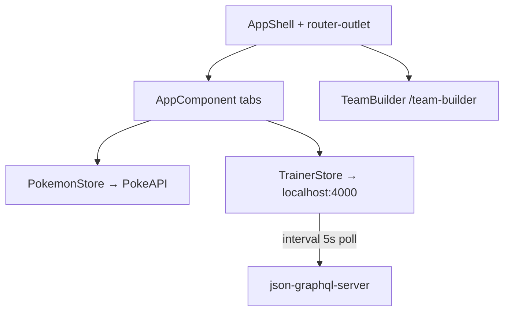

# Pokédex Trainer Dashboard

Angular SPA for browsing Pokémon (PokéAPI GraphQL), building teams, tracking battles, and managing a trainer profile (local `json-graphql-server`).

## Quick start

```bash
npm install

# Terminal 1 — required for teams, battles, profile
npm run mock:graphql

# Terminal 2
npm start
```

Open http://localhost:4200/

## Architecture



## Screenshots

Latest UI screenshots captured from the running app:

- Dashboard (hero + KPI cards + charts)
- Dashboard (recent battles + badges)
- Pokedex (filters + stat table + distribution chart)
- My Teams (team cards + create/edit/delete)
- Battle Log (log form + history table)
- Profile (trainer card + badges + stats)

Use these in the repository under `docs/screenshots/` with these recommended names:

- `dashboard-overview.png`
- `dashboard-details.png`
- `pokedex.png`
- `teams.png`
- `battle-log.png`
- `profile.png`

Example markdown once files are added:

```md


```

## Requirements coverage

| # | Requirement | Status |
|---|-------------|--------|
| 1 | PokéAPI queries (list, detail, types) | ✅ |
| 1 | Local queries + mutations | ✅ |
| 1 | Simulated battle log subscription (poll 5s) | ✅ |
| 2 | RxJS stores, selectors, optimistic teams | ✅ |
| 2 | debounceTime(300) search via selectors | ✅ |
| 2 | shareReplay type effectiveness | ✅ |
| 2 | retry(3) PokéAPI + local | ✅ |
| 2 | takeUntilDestroyed cleanup | ✅ |
| 3 | signal / computed / effect / toSignal | ✅ |
| 3 | input() / output() all components | ⚠️ Partial (legacy on some child components) |
| 3 | OnPush all components | ⚠️ Partial |
| 4 | Chart.js radar, bar, doughnut + animation | ✅ |
| 5 | Advanced team builder `/team-builder` | ✅ |
| 5 | Simple create-team modal | ✅ |
| 6 | Full Pokédex table + filters + multi-select | ✅ |
| 7 | Video + cry in detail panel | ✅ |
| 8 | JSDoc every method | ⚠️ Stores & selectors documented; not every file |
| — | Unit tests (5+) | ✅ |
| — | `ng build` / `ng serve` | ✅ |

## Bonus tasks attempted

| Bonus | Status |
|-------|--------|
| 3 Type effectiveness row highlight | ✅ `[appTypeHighlight]` directive |
| 5 Staggered table row entry | ✅ `.stagger-row` on Pokédex rows |
| 5 Tab route transitions | ✅ `@tabContent` + `withViewTransitions()` |
| 5 Skeleton shimmer loaders | ✅ Pokédex loading skeleton rows |
| 5 Pokéball loading spinner | ✅ CSS in Pokédex tab |
| 5 Toast slide-in/out | ✅ `ToastService` + slideOut animation |
| 5 Sprite bounce on hover | ✅ Pokédex table sprites |
| 1 Virtual scroll | Component exists, not wired to main tab |
| 2 Drag-drop team builder | Not implemented |
| 4 Web worker | Not implemented |
| 6 Offline IndexedDB Pokédex | ✅ `PokemonCacheService` |
| 6 Offline banner + mutation queue | ✅ `OfflineService` + `MutationQueueService` |

## Tests

```bash
npm test
```

- `app.component.spec.ts` — component signals
- `pokemon.selectors.spec.ts` — selector + stats
- `trainer.store.spec.ts` — store fetch
- `trainer.selectors.spec.ts` — win rate
- `validators.spec.ts` — form validators

## Routes

| Path | View |
|------|------|
| `/dashboard` | Dashboard + charts |

| `/pokedex` | Pokédex table |
| `/teams` | My Teams |
| `/battles` | Battles + live log feed |
| `/profile` | Editable trainer profile |
| `/team-builder` | Full advanced form |

## Troubleshooting

| Issue | Fix |
|-------|-----|
| Failed to create team | Run `npm run mock:graphql` |
| Stats show 0 | Fixed — stats normalized in store |
| Mock server crashes on start | Use `battleLogs` in `db.js` (not `battle_log` — json-graphql-server schema bug on Windows) |
